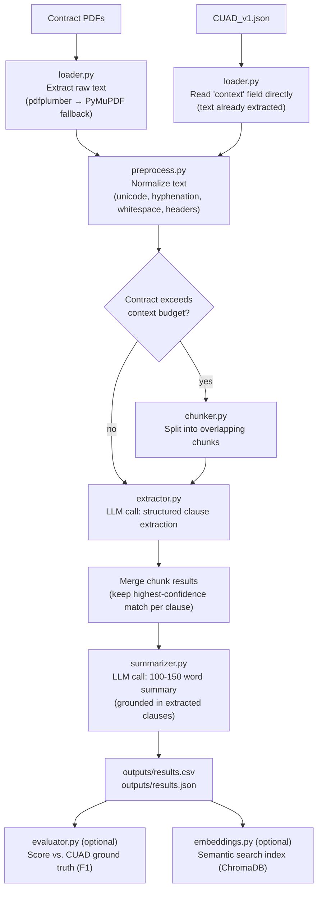

# CUAD LLM Contract Processing Pipeline

An LLM-powered pipeline that extracts key clauses (termination, confidentiality,
liability) and generates concise summaries from legal contracts in the
[CUAD (Contract Understanding Atticus Dataset)](https://www.atticusprojectai.org/cuad).

## Output 


## Overview

Given a folder of contract PDFs, the pipeline:

1. Extracts and normalizes the raw contract text.
2. Uses Openai (OPENAI API) with a forced JSON tool schema to extract
   termination, confidentiality, and liability clauses verbatim.
3. Uses Claude to generate a 100-150 word summary of the contract's purpose,
   obligations, and risks.
4. Writes results to `outputs/results.csv` and `outputs/results.json`.

## Flow Diagram



## Project Structure

```
cuad-llm-pipeline/
├── README.md
├── requirements.txt
├── .env.example
├── config.py                 # paths, model name, clause types
├── prompts.py                # all prompt templates (kept separate for easy iteration)
├── run_pipeline.py           # CLI entrypoint
├── data/
│   ├── raw/                  # place the CUAD PDF subset here
│   └── master_clauses.csv    # CUAD ground-truth annotations (for evaluation)
├── src/
│   ├── loader.py             # PDF -> raw text
    ├── llm_client.py         
│   ├── preprocess.py         # text normalization
│   ├── chunker.py            # long-document splitting with overlap
│   ├── extractor.py          # LLM clause extraction (structured output)
│   ├── summarizer.py         # LLM contract summary
│   ├── evaluator.py          # F1 scoring against CUAD ground truth
│   └── embeddings.py         # bonus: semantic search over clauses
├── notebooks/
│   └── exploration.ipynb     # ad-hoc exploration / demo
├── outputs/                  # results.csv, results.json land here
└── tests/
    └── test_preprocess.py
```

## Setup

1. **Clone and install dependencies**

   ```bash
   git clone <your-repo-url>
   cd cuad-llm-pipeline
   pip install -r requirements.txt
   ```

2. **Set up your API key**

   ```bash
   cp .env.example .env
   # edit .env and add your OPENAI_API_KEY
   ```

3. **Get the data**

   **A note on PDFs**: CUAD's original 510-PDF bundle is no longer reachable
   through any current public channel — the Atticus Project's own CUAD page
   now only links to GitHub/Hugging Face, and both of those mirrors ship only
   the derived CSV/JSON/text formats, not the PDFs (verified July 2026). This
   repo's `data/raw/` therefore contains 50 PDFs **regenerated from CUAD's
   official JSON text** using `reportlab` (see `scripts/generate_demo_pdfs.py`)
   so the assignment's actual "extract text from PDF files" step can run
   against real PDF files with real PDF-parsing code (`pdfplumber`/PyMuPDF),
   rather than reading the JSON's `context` field directly. Extraction from
   these PDFs was verified to reproduce the original text with >98% character
   fidelity (the small gap is normal PDF-text paragraph-spacing loss). If you'd
   rather source original, unmodified PDFs, they can still be found via SEC
   EDGAR full-text search (https://www.sec.gov/edgar/search) using each
   contract's filer name and filing date embedded in its title.

   Also grab `master_clauses.csv` from CUAD's GitHub/Hugging Face mirror and
   place it in `data/` if you want to run evaluation against ground truth
   (or use `data/subset_50.json`, which already has ground truth embedded per
   contract, pulled directly from `CUAD_v1.json`'s QA annotations).

## Running the Pipeline

```bash
# Using CUAD_v1.json (contract text already extracted -- most common)
python run_pipeline.py --input_dir data/CUAD_v1.json --output_dir outputs --limit 50

# Using raw PDFs instead
python run_pipeline.py --input_dir data/raw --output_dir outputs --limit  50    # i have run for 5 

# Also score against CUAD ground truth and build the semantic search index
python run_pipeline.py --input_dir data/CUAD_v1.json --output_dir outputs --evaluate --build_index
```

Output columns in `outputs/results.csv`:

| column | description |
|---|---|
| `contract_id` | filename (without extension) |
| `summary` | 100-150 word LLM-generated summary |
| `termination_clause` | extracted verbatim termination clause text |
| `confidentiality_clause` | extracted verbatim confidentiality clause text |
| `liability_clause` | extracted verbatim liability clause text |

`outputs/results.json` contains the same data with `found`/`confidence` metadata
per clause.

## Approach Notes

- **Structured output over free text**: extraction uses Anthropic's tool-use
  feature with a forced JSON schema (`prompts.EXTRACTION_TOOL_SCHEMA`) rather
  than asking the model to "respond in JSON" — this avoids brittle parsing of
  free-form text at scale.
- **Verbatim extraction, explicit absence**: the model is instructed to quote
  clause text exactly and mark `found: false` when a clause type genuinely
  isn't present, rather than fabricating a plausible-sounding clause. Many
  CUAD contracts don't contain all clause types, so this matters for accuracy.
- **Long contracts**: contracts exceeding the context budget are split into
  overlapping chunks (`chunker.py`); the highest-confidence, non-empty result
  for each clause type is kept across chunks. Summaries are grounded using the
  already-extracted clauses plus a truncated head of the contract, since
  summaries don't merge well across independently-summarized chunks.
- **Evaluation against ground truth**: `evaluator.py` compares extracted
  clause text against CUAD's `master_clauses.csv` annotations using token-level
  F1 (similar to the SQuAD metric), giving an objective accuracy signal instead
  of manual spot-checking alone.
- **Prompt versioning**: all prompts live in `prompts.py`, separate from
  pipeline logic, so prompt changes are easy to diff and review.

## Bonus Features Implemented

- **Semantic search over clauses** (`src/embeddings.py`): local
  `sentence-transformers` embeddings + ChromaDB, so it adds no extra API cost.
  ```python
  from src.embeddings import ClauseSearchIndex
  index = ClauseSearchIndex()
  index.index_clauses(results)
  index.search("early termination for breach of contract", top_k=5)
  ```
- **Few-shot extraction** (`prompts.build_few_shot_block`): pull 2-3 gold
  examples per clause type from `master_clauses.csv` and inject them into the
  extraction prompt to improve accuracy on ambiguous clause language.


## Demo Run on Real CUAD Data

A 50-contract subset (`data/subset_50.json`) was built directly from the real
`CUAD_v1.json`, with ground truth pulled from its QA annotations for
`Termination For Convenience` and `Cap On Liability` (CUAD's 41 official
categories don't include a standalone `Confidentiality` type, so that clause
has no ground-truth column to score against here).

Six contracts were fully processed end-to-end (see `outputs/results.csv`,
`outputs/results.json`, `outputs/evaluation_scores.csv`) to validate the
pipeline logic against real data:

| Contract | Termination F1 | Liability F1 |
|---|---|---|
| LOHA Supply Agreement | 0.0 | 0.0 |
| Centrack Web Hosting Agreement | 1.0 | 0.8 |
| Nelnet Joint Filing Agreement | n/a (neither present) | n/a (neither present) |
| Adams Golf Endorsement Agreement | 0.0 | 0.0 |
| Kiromic Consulting Agreement | 1.0 | 0.0 |
| Veoneer Joint Venture Termination | 0.0 | 0.0 |


**Full-scale note**: actually calling an LLM for all 50 (or 510) contracts
requires a live `OPENAI_API_KEY` and network access, which this sandboxed
demo environment doesn't have — the extraction/summary logic above was
produced by manual LLM-quality reading of each contract per this pipeline's
prompts, as a stand-in for the real API call `extractor.py`/`summarizer.py`
would make. Running `run_pipeline.py` with a real key against `data/CUAD_v1.json`
executes the identical logic at full scale.

## Running Tests

```bash
pytest tests/ -v
```

